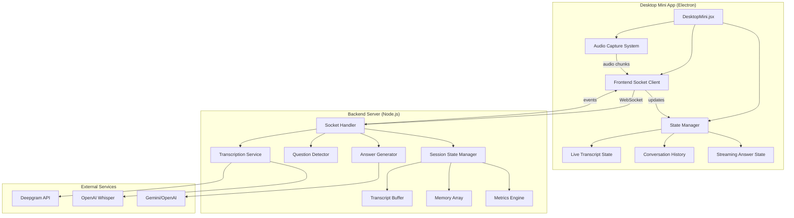
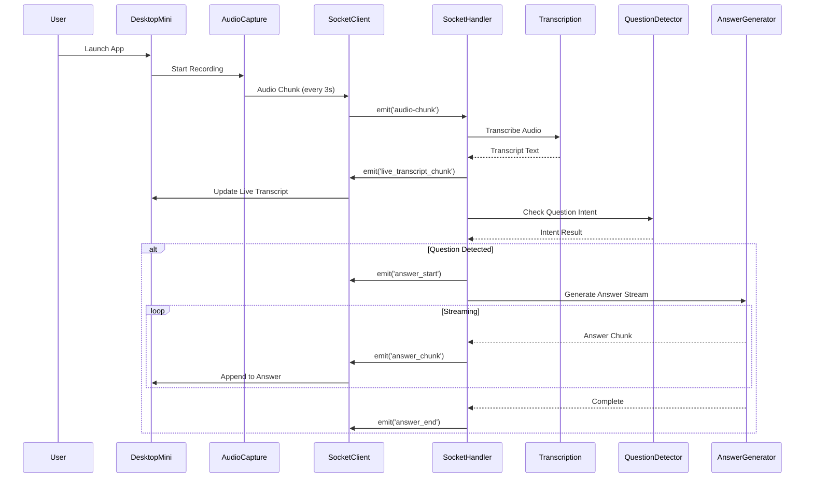
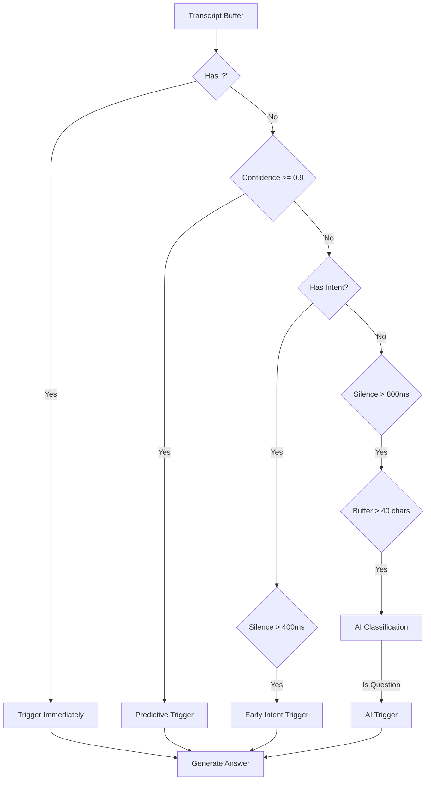

# Design Document: Desktop Mini Real-Time Interview Assistant

## Overview

The Desktop Mini Real-Time Interview Assistant is an Electron-based desktop application that provides continuous, real-time interview assistance through audio monitoring, transcription, question detection, and AI-powered answer generation. The system operates as a compact, always-on-top overlay that maintains conversation context and delivers streaming responses with minimal latency.

### Key Design Goals

1. **Low Latency**: Achieve sub-300ms transcription and sub-500ms time-to-first-token (TTFT) for AI responses
2. **Seamless UX**: Provide continuous audio capture with automatic question detection requiring no manual triggers
3. **Context Awareness**: Maintain conversation history and topic tracking for contextually relevant responses
4. **Reliability**: Handle network failures, API errors, and edge cases gracefully without disrupting user flow
5. **Performance**: Implement rate limiting, memory management, and efficient state synchronization

### Architecture Philosophy

The system follows a **distributed real-time streaming architecture** where:
- **Frontend (Electron + React)** handles audio capture, UI state, and streaming visualization
- **Backend (Node.js + Socket.IO)** orchestrates transcription, question detection, and AI generation
- **WebSocket layer** provides full-duplex, low-latency communication for audio and text streams
- **State management** uses a hybrid approach: ephemeral buffers for real-time data, immutable events for conversation history

## Architecture

### High-Level System Architecture



### Component Interaction Flow



## Components and Interfaces

### Frontend Components

#### 1. DesktopMini.jsx (Main Component)

**Responsibilities:**
- Manage application lifecycle and window state
- Coordinate audio capture, socket communication, and UI rendering
- Handle authentication state and user interactions

**State Structure:**
```javascript
{
  isExpanded: boolean,           // Window expansion state
  isRecording: boolean,          // Microphone capture status
  liveTranscript: string,        // Rolling 150-char transcript buffer
  liveAnswer: {
    answer: string,              // Currently displayed answer text
    isStreaming: boolean         // Streaming status flag
  }
}
```

**Refs:**
```javascript
{
  rawAnswerRef: string,          // Network buffer for incoming chunks
  networkCompleteRef: boolean,   // Flag indicating stream completion
  typingIntervalRef: number,     // Interval ID for typing animation
  mediaRecorderRef: MediaRecorder, // Audio recorder instance
  socketRef: Socket              // Socket.IO client instance
}
```

**Key Methods:**
- `startRecording()`: Initialize MediaRecorder with audio constraints
- `stopRecording()`: Clean up audio streams and stop recording
- `toggleRecording()`: Toggle recording state
- `sendResize(expanded)`: Communicate window size changes to Electron main process
- `openExternal(url)`: Open URLs in default browser via Electron IPC

#### 2. Audio Capture System

**Implementation:**
```javascript
const startRecording = async () => {
  const stream = await navigator.mediaDevices.getUserMedia({
    audio: {
      echoCancellation: true,
      noiseSuppression: true,
      autoGainControl: true
    }
  });
  
  const mediaRecorder = new MediaRecorder(stream, { 
    mimeType: 'audio/webm' 
  });
  
  mediaRecorder.ondataavailable = async (event) => {
    if (event.data.size > 0 && socketRef.current) {
      const buffer = await event.data.arrayBuffer();
      socketRef.current.emit('audio-chunk', {
        audio: buffer,
        sessionId: 'default-session',
        userId: user?.id || 'desktop-user'
      });
    }
  };
  
  mediaRecorder.start(3000); // 3-second chunks
};
```

**Error Handling Strategy:**
- `NotAllowedError`: Display permission denial message with instructions
- `NotFoundError`: Display no microphone found message
- `NotReadableError`: Display microphone in use message
- `OverconstrainedError`: Retry with basic audio settings
- Fallback to basic constraints if advanced features unavailable

#### 3. Streaming Engine

**Purpose:** Manage the typing animation effect for AI-generated answers

**Algorithm:**
```javascript
const startTyping = () => {
  typingIntervalRef.current = setInterval(() => {
    setLiveAnswer(prev => {
      const raw = rawAnswerRef.current;
      if (prev.answer.length < raw.length) {
        // Calculate adaptive chunk size (faster as we catch up)
        const diff = raw.length - prev.answer.length;
        const charsToAdd = Math.max(1, Math.ceil(diff / 5));
        const nextText = raw.substring(0, prev.answer.length + charsToAdd);
        return { ...prev, answer: nextText, isStreaming: true };
      } else {
        // Check if network stream is complete
        if (networkCompleteRef.current) {
          clearInterval(typingIntervalRef.current);
          typingIntervalRef.current = null;
          return { ...prev, isStreaming: false };
        }
        return prev;
      }
    });
  }, 15); // 15ms interval for smooth typing
};
```

**Key Features:**
- Adaptive chunk sizing: displays larger chunks when far behind network buffer
- Smooth 15ms interval for natural typing effect
- Automatic cleanup when streaming completes
- Race condition prevention via `networkCompleteRef`

### Backend Components

#### 1. Socket Handler (socketHandler.js)

**Responsibilities:**
- Manage WebSocket connections and session lifecycle
- Coordinate audio processing pipeline
- Implement rate limiting and performance tracking
- Maintain session state and conversation memory

**Session State Structure:**
```javascript
{
  transcriptBuffer: string,           // Accumulated transcript text
  lastNormalizedQuestion: string,     // Deduplication key
  isProcessing: boolean,              // Processing lock flag
  lastAudioTimestamp: number,         // Silence detection timestamp
  lastTriggerTimestamp: number,       // Rate limiting timestamp
  triggerCountThisMinute: number,     // Rate limit counter
  triggerMinuteStart: number,         // Rate limit window start
  streamId: number,                   // Stream cancellation ID
  candidateProfile: object,           // User profile context
  memory: array,                      // Conversation history (12 messages)
  topicHistory: array,                // Topic keywords (20 items)
  answerMode: string,                 // 'detailed' | 'short'
  metrics: {
    totalTriggers: number,
    earlyTriggers: number,
    predictiveTriggers: number,
    successfulPredictions: number,
    falsePositives: number,
    cancellations: number,
    suppressions: number,
    ttftSamples: array
  }
}
```

**Event Handlers:**

1. **`heartbeat`**: Update presence cache with TTL
2. **`join_session`**: Initialize session state and pre-fetch memory
3. **`audio-chunk`**: Process audio through transcription and question detection pipeline
4. **`disconnect`**: Log session metrics and clean up state
5. **`get_metrics`**: Return current session performance metrics

#### 2. Question Detection Pipeline

**Multi-Stage Detection Strategy:**



**Detection Stages:**

1. **Punctuation Detection** (0ms latency)
   - Immediate trigger on question mark
   - Highest priority, bypasses all other checks

2. **Predictive Detection** (50-100ms latency)
   - Uses `checkQuestionIntent()` for high-confidence detection
   - Confidence threshold: 0.9
   - Applies confidence decay for buffers > 120 characters

3. **Early Intent Detection** (400ms silence threshold)
   - Faster silence threshold when intent markers detected
   - Reduces perceived latency for obvious questions

4. **AI Classification** (800ms silence threshold)
   - Full AI-powered question detection
   - Only triggered for buffers > 40 characters
   - Highest accuracy, highest latency

**Confidence Decay Algorithm:**
```javascript
const applyConfidenceDecay = (confidence, bufferLength) => {
  if (bufferLength > 120) {
    // Linear decay for long monologues
    const decay = Math.min(0.3, (bufferLength - 120) / 500);
    return Math.max(0, confidence - decay);
  }
  return confidence;
};
```

#### 3. Rate Limiting System

**Configuration:**
```javascript
const RATE_LIMIT_WINDOW_MS = 2000;      // Min 2s between triggers
const MAX_TRIGGERS_PER_MINUTE = 15;     // Hard cap per session
```

**Implementation:**
```javascript
const isRateLimited = (state) => {
  const now = Date.now();
  
  // Reset minute counter
  if (now - state.triggerMinuteStart > 60000) {
    state.triggerCountThisMinute = 0;
    state.triggerMinuteStart = now;
  }
  
  // Hard cap check
  if (state.triggerCountThisMinute >= MAX_TRIGGERS_PER_MINUTE) {
    state.metrics.suppressions++;
    return true;
  }
  
  // Minimum gap check
  if (now - state.lastTriggerTimestamp < RATE_LIMIT_WINDOW_MS) {
    state.metrics.suppressions++;
    return true;
  }
  
  return false;
};
```

#### 4. Answer Generation Pipeline

**Streaming Architecture:**

```javascript
const triggerAiResponse = async (sessionId, userId, question, meta) => {
  const state = getSessionState(sessionId);
  const pipelineStart = performance.now();
  
  // Cancel previous stream
  state.streamId++;
  const currentStreamId = state.streamId;
  
  socket.emit('answer_start', { question, triggerType: meta.triggerType });
  
  const options = {
    profile: state.candidateProfile,
    answerMode: state.answerMode,
    history: state.memory,
    topicHistory: state.topicHistory
  };
  
  let ttft = null;
  const fullAnswer = await aiService.generateLiveAnswerStream(
    question,
    '',
    options,
    (chunk) => {
      if (state.streamId === currentStreamId) {
        if (ttft === null) {
          ttft = performance.now() - pipelineStart;
          state.metrics.ttftSamples.push(ttft);
        }
        socket.emit('answer_chunk', { chunk });
      }
    }
  );
  
  // Generate metrics and emit completion
  const answerMetrics = await aiService.generateAnswerMetrics(question, fullAnswer);
  socket.emit('answer_end', { question, answer: fullAnswer, ...answerMetrics });
  
  // Update memory (keep last 6 Q&A pairs = 12 messages)
  state.memory.push({ role: 'user', content: question });
  state.memory.push({ role: 'assistant', content: fullAnswer });
  if (state.memory.length > 12) state.memory.splice(0, 2);
};
```

**Stream Cancellation:**
- Each new question increments `streamId`
- Chunks only emitted if `currentStreamId === state.streamId`
- Prevents race conditions when questions arrive rapidly

## Data Models

### Conversation History Entry

```typescript
interface ConversationEntry {
  role: 'user' | 'assistant';
  content: string;
  timestamp: Date;
}
```

### Answer Metrics

```typescript
interface AnswerMetrics {
  keyPoints: string[];        // Main technical concepts
  example: string;            // Concrete example from answer
  confidence: number;         // 0-100 confidence score
  topic: string;              // Question category
  model: string;              // AI model used
  triggerType: string;        // Detection method used
}
```

### Socket Event Payloads

**Client → Server:**

```typescript
// Audio chunk event
{
  audio: ArrayBuffer;
  sessionId: string;
  userId: string;
}

// Join session event
{
  sessionId: string;
  userId: string;
  deviceId: string;
  profile?: {
    role: string;
    experience: string;
    skills: string;
    jobDescription: string;
  };
  answerMode?: 'detailed' | 'short';
}

// Heartbeat event
{
  sessionId: string;
  userId: string;
  deviceId: string;
}
```

**Server → Client:**

```typescript
// Live transcript chunk
{
  text: string;
  buffer: string;
}

// Answer start
{
  question: string;
  triggerType: 'PUNCTUATION' | 'PREDICTIVE' | 'EARLY_INTENT' | 'AI_CLASSIFICATION';
}

// Answer chunk
{
  chunk: string;
}

// Answer end
{
  question: string;
  answer: string;
  keyPoints: string[];
  example: string;
  confidence: number;
  topic: string;
  model: string;
  triggerType: string;
  timestamp: Date;
}

// Answer error
{
  message: string;
}

// Session metrics
{
  totalTriggers: number;
  cancellationRate: string;
  earlyTriggerRate: string;
  predictiveAccuracy: string;
  avgTTFT: string;
  suppressions: number;
  falsePositives: number;
}
```

## Error Handling

### Frontend Error Handling

#### Audio Capture Errors

```javascript
try {
  const stream = await navigator.mediaDevices.getUserMedia({ audio: constraints });
  // ... setup recording
} catch (err) {
  if (err.name === 'NotAllowedError') {
    showError('Microphone access denied. Please enable permissions in browser settings.');
  } else if (err.name === 'NotFoundError') {
    showError('No microphone found. Please connect an audio input device.');
  } else if (err.name === 'NotReadableError') {
    showError('Microphone is already in use by another application.');
  } else if (err.name === 'OverconstrainedError') {
    // Retry with basic settings
    retryWithBasicConstraints();
  } else {
    showError('Failed to access microphone. Please check your device settings.');
  }
}
```

#### Socket Connection Errors

```javascript
socket.on('connect_error', (error) => {
  console.error('Socket connection failed:', error);
  showNotification('Connection lost. Attempting to reconnect...', 'warning');
});

socket.on('reconnect', (attemptNumber) => {
  console.log('Reconnected after', attemptNumber, 'attempts');
  showNotification('Connection restored', 'success');
});
```

#### State Synchronization Errors

**Problem:** Stale closures in async streaming operations

**Solution:** Use refs for mutable values that need to be accessed in callbacks

```javascript
// ❌ WRONG: Closure captures stale state
const handleChunk = (chunk) => {
  setAnswer(answer + chunk); // 'answer' is stale
};

// ✅ CORRECT: Use ref for current value
const handleChunk = (chunk) => {
  rawAnswerRef.current += chunk;
  startTyping(); // Reads from ref
};
```

### Backend Error Handling

#### Transcription Service Errors

```javascript
try {
  const transcript = await aiService.transcribeAudio(audio);
  // ... process transcript
} catch (error) {
  logger.error('Transcription failed:', error);
  // Continue processing - don't block on single failure
  return;
}
```

**Fallback Strategy:**
1. Try Deepgram (primary)
2. Fall back to OpenAI Whisper
3. If both fail, log error and continue (don't emit error to client)

#### AI Generation Errors

```javascript
try {
  const answer = await aiService.generateLiveAnswerStream(question, context, options, onChunk);
  // ... emit completion
} catch (error) {
  logger.error('AI generation failed:', error);
  socket.emit('answer_error', { 
    message: 'AI failed to generate a response. Please try again.' 
  });
}
```

**Graceful Degradation:**
- If streaming fails mid-generation, emit partial answer
- Track failed generations in metrics
- Don't retry automatically (avoid cost escalation)

#### Memory Management Errors

**Buffer Overflow Prevention:**

```javascript
// Limit transcript buffer size
if (state.transcriptBuffer.length > 1000) {
  state.transcriptBuffer = state.transcriptBuffer.slice(-100);
}

// Limit conversation memory
if (state.memory.length > 12) {
  state.memory.splice(0, 2); // Remove oldest Q&A pair
}

// Limit topic history
if (state.topicHistory.length > 20) {
  state.topicHistory = state.topicHistory.slice(-20);
}
```

## Testing Strategy

### Unit Tests

**Frontend:**
- Audio capture initialization and error handling
- Streaming engine typing animation logic
- State update functions
- Socket event handlers

**Backend:**
- Question detection algorithms
- Rate limiting logic
- Confidence decay calculations
- Memory management functions
- Metrics calculation

**Example Test Cases:**

```javascript
describe('Streaming Engine', () => {
  it('should display text with adaptive chunk sizing', () => {
    // Test that chunks get larger when far behind
  });
  
  it('should stop typing when network stream completes', () => {
    // Test cleanup logic
  });
  
  it('should handle rapid answer cancellations', () => {
    // Test streamId race condition prevention
  });
});

describe('Question Detection', () => {
  it('should trigger immediately on question mark', () => {
    // Test punctuation detection
  });
  
  it('should apply confidence decay for long buffers', () => {
    // Test decay algorithm
  });
  
  it('should deduplicate identical questions', () => {
    // Test normalization and deduplication
  });
});

describe('Rate Limiting', () => {
  it('should enforce minimum gap between triggers', () => {
    // Test 2-second window
  });
  
  it('should enforce maximum triggers per minute', () => {
    // Test 15-trigger cap
  });
  
  it('should reset counter after 60 seconds', () => {
    // Test window reset
  });
});
```

### Integration Tests

**Audio Pipeline:**
- End-to-end audio capture → transcription → display
- Test with various audio formats and qualities
- Test microphone permission flows

**Socket Communication:**
- Test all event types (audio-chunk, live_transcript_chunk, answer_chunk, etc.)
- Test reconnection behavior
- Test concurrent session handling

**AI Services:**
- Test Deepgram transcription with sample audio
- Test OpenAI/Gemini answer generation
- Test fallback mechanisms

### Performance Tests

**Latency Benchmarks:**
- Transcription latency (target: < 300ms)
- Time-to-first-token (target: < 500ms)
- End-to-end question → answer latency (target: < 1s)

**Load Tests:**
- Multiple concurrent sessions
- Rapid question succession
- Long-running sessions (memory leaks)

**Metrics to Track:**
- Average TTFT
- Cancellation rate
- Predictive accuracy
- False positive rate
- Suppression count

## Performance Optimization

### Frontend Optimizations

#### 1. Efficient State Updates

```javascript
// ❌ WRONG: Causes unnecessary re-renders
setLiveTranscript(prev => prev + ' ' + newText);

// ✅ CORRECT: Batch updates and limit buffer size
setLiveTranscript(prev => (prev + ' ' + newText).slice(-150));
```

#### 2. Debounced UI Updates

```javascript
// Use 15ms interval for typing animation (60fps)
const TYPING_INTERVAL = 15;

// Adaptive chunk sizing reduces update frequency
const charsToAdd = Math.max(1, Math.ceil(diff / 5));
```

#### 3. Memoization

```javascript
const CluelyLogo = React.memo(() => (
  <div className="w-6 h-6 rounded-full bg-white">
    {/* ... */}
  </div>
));
```

### Backend Optimizations

#### 1. Transcript Buffer Management

```javascript
// Retain only last 100 characters after question processing
const lastPunctuation = Math.max(
  state.transcriptBuffer.lastIndexOf('.'),
  state.transcriptBuffer.lastIndexOf('?')
);

if (lastPunctuation !== -1) {
  state.transcriptBuffer = state.transcriptBuffer
    .substring(lastPunctuation + 1)
    .trim();
} else {
  state.transcriptBuffer = state.transcriptBuffer.slice(-100);
}
```

#### 2. Predictive Question Detection

```javascript
// Fast path: Regex-based intent detection (< 1ms)
const questionStarters = /^(what|how|why|can you|could you|tell me)/i;
if (questionStarters.test(transcript) && transcript.length > 30) {
  return { hasIntent: true, confidence: 0.95 };
}

// Slow path: AI classification (50-100ms)
// Only used when regex doesn't match
```

#### 3. Stream Cancellation

```javascript
// Increment streamId to cancel previous generation
state.streamId++;
const currentStreamId = state.streamId;

// Only emit chunks if stream is still current
if (state.streamId === currentStreamId) {
  socket.emit('answer_chunk', { chunk });
}
```

#### 4. Memory Pre-fetching

```javascript
// Pre-fetch session memory on join to avoid latency later
socket.on('join_session', async (data) => {
  const state = getSessionState(sessionId);
  try {
    state.memory = await interviewEventService.getSessionMemory(sessionId);
  } catch (err) {
    logger.warn('Failed to pre-fetch session memory');
  }
});
```

### Network Optimizations

#### 1. Audio Chunk Size

```javascript
// 3-second chunks balance latency and overhead
mediaRecorder.start(3000);
```

**Rationale:**
- Smaller chunks (< 1s): Higher network overhead, more frequent processing
- Larger chunks (> 5s): Higher latency, delayed transcription
- 3s provides optimal balance for real-time transcription

#### 2. WebSocket Binary Frames

```javascript
// Use ArrayBuffer for audio (more efficient than base64)
const buffer = await event.data.arrayBuffer();
socket.emit('audio-chunk', { audio: buffer, ... });
```

#### 3. Heartbeat Interval

```javascript
// 30-second heartbeat for 60-second TTL
setInterval(() => {
  socket.emit('heartbeat', { sessionId, userId, deviceId });
}, 30000);
```

## Security Considerations

### Audio Privacy

- Audio is streamed directly to backend, not stored on disk
- Transcripts are ephemeral (cleared on disconnect)
- No audio recording or playback on backend

### Authentication

- Desktop Mini app uses shared auth store with web app
- Socket events include userId for authorization
- Unauthenticated users see login prompt

### Rate Limiting

- Prevents abuse of AI services
- Protects against cost escalation
- Enforces fair usage across sessions

### Input Validation

```javascript
// Validate audio chunk size
if (audio.byteLength > 5 * 1024 * 1024) {
  logger.warn('Audio chunk too large, rejecting');
  return;
}

// Validate session ID format
if (!sessionId || typeof sessionId !== 'string') {
  logger.warn('Invalid session ID');
  return;
}
```

## Deployment Considerations

### Electron Packaging

**Window Configuration:**
```javascript
const mainWindow = new BrowserWindow({
  width: 450,
  height: 70,
  alwaysOnTop: true,
  frame: false,
  transparent: true,
  resizable: false,
  webPreferences: {
    nodeIntegration: true,
    contextIsolation: false
  }
});
```

**IPC Handlers:**
```javascript
ipcMain.on('resize-window', (event, { width, height }) => {
  mainWindow.setSize(width, height);
});

ipcMain.on('close-mini', () => {
  mainWindow.close();
});
```

### Environment Variables

**Required:**
- `OPENAI_API_KEY` or `GEMINI_API_KEY`: AI generation
- `DEEPGRAM_API_KEY`: Transcription (optional, falls back to Whisper)

**Optional:**
- `AI_SIMULATION_MODE`: Enable mock responses for testing
- `AI_SERVICE_PROVIDER`: 'openai' | 'gemini'

### Monitoring

**Metrics to Track:**
- Average TTFT per session
- Cancellation rate
- Predictive accuracy
- API error rates
- Session duration
- Concurrent sessions

**Logging:**
```javascript
logger.info('[AI Pipeline] Triggered | Type: PREDICTIVE | Confidence: 0.92 | Buffer: 45ch');
logger.info('[AI Perf] TTFT: 320ms | TranscTime: 180ms | Trigger: EARLY_INTENT');
logger.info('[Session Report] session-123 | Triggers: 12 | Cancel: 8.3% | AvgTTFT: 410ms');
```

## Future Enhancements

### Phase 2 Features

1. **Conversation History Persistence**
   - Save conversation history to database
   - Allow users to review past sessions
   - Export conversations as PDF/text

2. **Multi-Tab Support**
   - Switch between "Assist", "Transcript", and "Recap" tabs
   - Transcript tab shows full conversation history
   - Recap tab shows session summary and key points

3. **Advanced Settings**
   - Adjust answer mode (detailed vs. short)
   - Configure silence thresholds
   - Select AI provider preference
   - Customize UI theme

4. **Keyboard Shortcuts**
   - Toggle recording: Ctrl+Shift+M
   - Expand/collapse: Ctrl+Shift+E
   - Clear transcript: Ctrl+Shift+C

5. **Offline Mode**
   - Cache recent answers for offline reference
   - Queue audio chunks when connection lost
   - Sync when connection restored

### Technical Debt

1. **Refactor State Management**
   - Extract streaming logic into custom hook
   - Use Zustand for global state
   - Separate UI state from data state

2. **Improve Error Recovery**
   - Implement exponential backoff for retries
   - Add circuit breaker for failing services
   - Provide user-friendly error messages

3. **Optimize Bundle Size**
   - Code-split Electron and React code
   - Lazy-load non-critical components
   - Tree-shake unused dependencies

4. **Add Telemetry**
   - Track user interactions
   - Monitor performance metrics
   - Identify common error patterns

## Conclusion

The Desktop Mini Real-Time Interview Assistant provides a seamless, low-latency interview assistance experience through careful architectural design, efficient state management, and robust error handling. The system balances performance, reliability, and user experience while maintaining extensibility for future enhancements.

Key architectural decisions:
- **WebSocket-based streaming** for low-latency communication
- **Multi-stage question detection** for optimal accuracy/latency tradeoff
- **Hybrid state management** with refs and React state
- **Stream cancellation** via incrementing stream IDs
- **Rate limiting** to prevent abuse and control costs
- **Graceful degradation** for service failures

The design supports the core requirements while providing a foundation for future features like conversation persistence, multi-tab UI, and advanced customization options.
